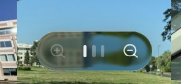

<p align="center">
  
  <h1 align='center'>Camera Roll</h1>
</p>

A personal photo browser for making large iPhone backups (and any photo albums) usable and searchable again.

I have years of iPhone photos sitting on my Windows PC as nested backup folders.
In that format they are practically unusable: 
- there is no gallery view
- there is no proper searchability/indexing
- HEIC/HEIF & HEVC format support is not great

As a result, the backup, whose original goal was to preserve memories accessibly acts as more of an emergency archive (and it isn't even good at that, since searchability is so poor). The goal was an app that turns the mess back into something I actually want to look through.

This is a private (mostly vibe coded) tool, not a product. It is not meant for public distro, deployment, or running on someone else's machine. It exists to make my own libraries browsable and searchable.

## What it does today

- Points at folders of photos (including HEIC/HEIF from iPhone) and indexes everything underneath it, no matter how deeply nested.
- Sorts the whole library by capture time, pulled from EXIF where available and falling back to the file's modification time.
- Shows a single continuous camera-roll grid with smooth zoom, a detail viewer, and a filmstrip for moving between photos.
- Converts non-web formats (HEIC, TIFF, BMP) to JPEG on the fly for display.
- Indexes images (currently by capture time and by faces within the images, and location from EXIF data) so they can be inspected, and most importantly, *searched*!

## How it's built

A Tauri desktop shell with a React frontend and a Python backend that does the
image work.

- **`src/`** — React + TypeScript + Tailwind UI. The grid, detail viewer, filmstrip, zoom stepper, and frosted-glass chrome. UI conventions are defined in [AGENTS.md](./AGENTS.md) and followed throughout.
- **`src-tauri/`** — the Rust/Tauri shell. Applies the native window blur and spawns/tears down the Python backend as a sidecar process. See `src-tauri/src/lib.rs`.
- **`server/`** — a FastAPI backend that indexes the library and serves the index, thumbnails, mega-tiles, and full images over a local HTTP port. The heavy lifting (thumbnailing, tile composition) runs across a process pool. See `server/app.py` and `server/imaging.py`.

The frontend talks to the backend directly over `http://127.0.0.1:8756` (see `src/lib/photoApi.ts`).

## Running it

1. **Frontend + Tauri deps**

```bash
npm install
```

2. **Backend** — from `server/`, create a virtualenv and install dependencies (the app auto-detects `server/.venv`; see [server/README.md](./server/README.md)):

```bash
python -m venv .venv
.venv\Scripts\Activate.ps1   # Windows PowerShell
pip install -r requirements.txt
```

4. **Run** — launch the desktop app, which boots the backend automatically:

```bash
npm run app          # tauri dev
```

## Indexing

By indexing the photos using various methods, I made albums of disorganized photos completely scrollable and searchable by various qualities. This is incredibly helpful for finding photos of specific people, photos taken in specific locations, at specific dates, or all of the above. The app out of the box spends the first few usage sessions indexing the photos by these qualities; this indexing can happen upfront, multithreaded (faster), or in the background, single-threaded (slower).

### 1. People (face recognition) [DONE]
Run images through a face-recognition model during indexing to detect **persistent faces** across the library. Cluster recurring faces into "people" in the index so you can open a selection for a single person and see every photo they appear in.

> ajaya boston jan 2026

and getting back the photos of that person, at that place, around that time. This works for people (and groups of people!) but will continue to evolve as more types of tags emerge.

### 2. Location and metadata [DONE]
Index by **capture location** (GPS from EXIF) and other metadata fields, so photos can be grouped and filtered by place, device, date range, and similar.

### 3. Unified search [DONE]
Tie all forms of tags (including People, Location, & Date) together into one **comprehensive search** so a single natural query spans all of them. The target experience is typing something like:

### 4. Text in images (OCR) [PLANNED]
Index images with OCR so we know which photos contain text. This feeds into the search index so text inside a photo becomes findable.

## Design Decisions
I wanted this experience to feel as close as possible to the Photos app on my phone, while obviously being a desktop app. To accomplish this, I made several UX decisions to keep the experience feeling Apple-native on a windows machine.

### 1. Liquid Glass on Windows (!)
While this isn't "necessary" for a photo viewing app, it was an interesting challenge to emulate the complex optical effects to create something that felt more premium, and a side effect of this was that the experience felt more akin to the iPhone app -- since that had liquid glass everywhere. The steps to recreate the effect involved:

- Using a dynamically generated SVG-displacement map for refractions
Carefully crafted fluid css transitions (timing position and bounds curves to make a jelly-like feel)
- Glow (dark drop shadows and light caustics) effects
- Blurring and saturating underlying layers to make it tinted/frosted
- Glinted borders

There were also technical hurdles, like the fact that optical effects can't "see" the Windows Acrylic layer, so I had to create an involved workaround that dynamically created a matte for all Liquid Glass elements that pulled through a screengrab of the desktop below the app so areas where acrylic was visible through the glass didn't appear "ghosted".

But by doing all of these, I was able to create a near 1:1 replication of the *Liquid Glass* effect visible on Apple devices -- this drastically increased the immersion.



### 2. Font choice
While I had originally gone with Google Sans as my font of choice in early versions of this product, it made the experience feel more removed from the goal of trying to be my "second camera roll". After going through the effort of implementing Liquid Glass, it just made sense to go with San Francisco as my font of choice throughout.